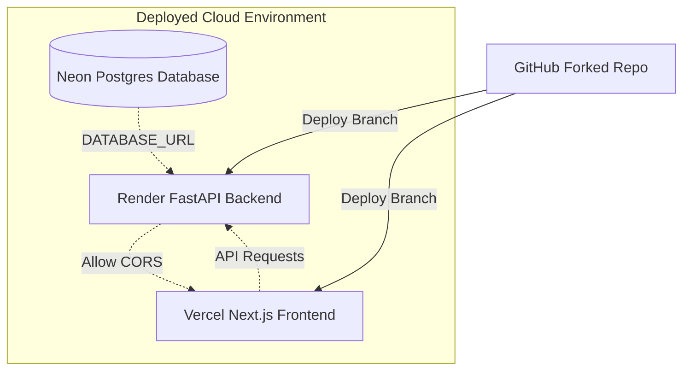

# GitHire Free-Tier End-to-End Deployment Design

This document outlines the architecture, configuration, and step-by-step design for deploying the GitHire monorepo (FastAPI backend + Next.js frontend + PostgreSQL) using a 100% free hosting stack (Neon, Render, and Vercel) without requiring a credit card.

## 1. System Architecture

* **Database Layer:** Neon PostgreSQL (Serverless Postgres with a free tier).
* **Backend Layer:** Render Web Services (Free CPU/RAM allocation running the backend Docker container).
* **Frontend Layer:** Vercel (Global Edge Network running the TypeScript Next.js app).

---

## 2. Environment Variables Configuration

### Render Backend (`/backend`)

| Variable | Value | Purpose |
|---|---|---|
| `DATABASE_URL` | `postgresql://...` (from Neon) | Database connection string |
| `GEMINI_API_KEY` | *User Provided* | AI check and resume screening functionality |
| `CORS_ORIGINS` | `https://<your-app>.vercel.app` | Allow cross-origin requests from Vercel frontend |
| `CLERK_JWKS_URL` | `https://<your-clerk-instance>.well-known/jwks.json` | Authenticating JWTs in request headers |
| `CLERK_ISSUER` | `https://<your-clerk-instance>` | Token issuer URL |

### Vercel Frontend (`/linkify`)

| Variable | Value | Purpose |
|---|---|---|
| `NEXT_PUBLIC_APP_NAME` | `GitHire` | Application branding |
| `NEXT_PUBLIC_API_URL` | `https://<your-service>.onrender.com` | Target API endpoints for fetch requests |
| `NEXT_PUBLIC_CLERK_PUBLISHABLE_KEY` | *User Provided* | Clerk Auth client-side initialization |
| `CLERK_SECRET_KEY` | *User Provided* | Clerk Auth server-side API calls |

---

## 3. Deployment Flow

1. **Database (Neon):**
   - Create a project on Neon.
   - Use the connection string to restore `githire_backup.sql` locally to Neon.
2. **Backend (Render):**
   - Import the fork.
   - Set Root Directory to `backend`.
   - Set Environment to `Docker` (uses existing `Dockerfile`).
   - Populate environment variables.
3. **Frontend (Vercel):**
   - Import the fork.
   - Set Root Directory to `linkify` and Framework to `Next.js`.
   - Populate environment variables (pointing to the Render URL).
   - Re-link Vercel URL back to Render's `CORS_ORIGINS` setting.
