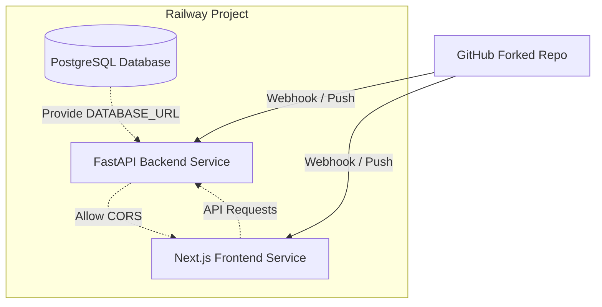

# GitHire End-to-End Railway Deployment Design

This document details the architecture and configuration design for deploying the GitHire monorepo (FastAPI backend + Next.js frontend + PostgreSQL) to Railway using Git Integration from a forked repository.

## 1. Repository Access & Forking Setup

To deploy from a different GitHub account, the flow is:
1. Log in to the target GitHub account (Account B).
2. Visit the original repository: `https://github.com/zgii14/HACKATHON`.
3. Click **Fork** to copy the repository to Account B (`https://github.com/AccountB/HACKATHON`).
4. Ensure the repository visibility is Public (or Private, provided Railway has access).

## 2. Railway Architecture & Deployment Model

We use **Approach 1: Single Project, Multi-Service**.
All services reside within one Railway project to share resources and make environment variable mapping seamless.



### Services Breakdown:

1. **Postgres Service**
   - Built-in Railway PostgreSQL plugin.
   - Generates the standard connection credentials (`PGHOST`, `PGPORT`, `PGUSER`, `PGPASSWORD`, `PGDATABASE`, `DATABASE_URL`).

2. **Backend Service**
   - **Root Directory:** `/backend`
   - **Build Method:** Dockerfile (runs `uvicorn app.main:app`)
   - **Healthcheck Path:** `/health` (Timeout: 300 seconds)

3. **Frontend Service**
   - **Root Directory:** `/linkify`
   - **Build Method:** Nixpacks (runs `npm run build` & `npm start`)
   - **Healthcheck Path:** `/` (Timeout: 60 seconds)

---

## 3. Environment Variables Configuration

### Backend Service (FastAPI)

| Variable | Source / Value | Purpose |
|---|---|---|
| `DATABASE_URL` | `${{Postgres.DATABASE_URL}}` | Connects backend to the provisioned Postgres database |
| `GEMINI_API_KEY` | *User Provided* | AI-based CV check & matching features |
| `CORS_ORIGINS` | `https://<frontend-service-domain>.up.railway.app` | Allow cross-origin requests from the frontend |
| `CLERK_JWKS_URL` | `https://<clerk-instance>.well-known/jwks.json` | Token validation for authenticated API routes |
| `CLERK_ISSUER` | `https://<clerk-instance>` | JWT issuer validation |

### Frontend Service (Next.js)

| Variable | Source / Value | Purpose |
|---|---|---|
| `NEXT_PUBLIC_APP_NAME` | `GitHire` | Application branding |
| `NEXT_PUBLIC_API_URL` | `https://<backend-service-domain>.up.railway.app` | Target for frontend fetch requests |
| `NEXT_PUBLIC_CLERK_PUBLISHABLE_KEY` | *User Provided* | Clerk Auth frontend client key |
| `CLERK_SECRET_KEY` | *User Provided* | Clerk Auth backend server key |

---

## 4. Database Restoration (Seeding)

To restore the `githire_backup.sql` database schema and mock data:
1. Install PostgreSQL client locally (specifically `psql`).
2. Retrieve the external database connection string from the Railway Postgres service (Variables -> `DATABASE_PUBLIC_URL`).
3. Run the restore command locally:
   ```bash
   psql -d "DATABASE_PUBLIC_URL_FROM_RAILWAY" -f githire_backup.sql
   ```
4. Verify database tables are correctly created.
